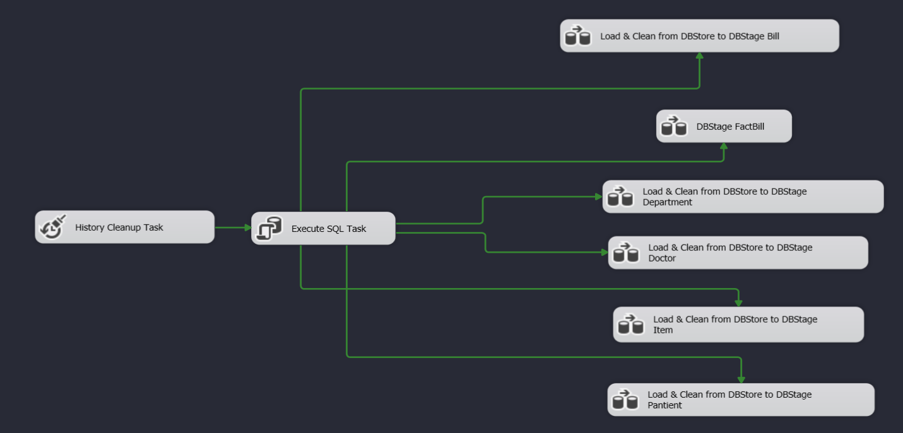

# Hopepital Datawarehouse

Data storage of invoice information of Children's Hospital

## Badges

## Data decription

- ERD Datawarehouse
  

Data is taken from data sources taken from hospitals. Hopefully, data is a collection of information about patients' medical examinations, transactions, services, accounts, clinics... compiled based on chemistry. hospital application in 2016.

To synthesize and store the above data for the purpose of analyzing operational situations, as well as supporting decision making. Therefore, the team conducted research and built a patient data warehouse to meet the hospital's needs.

## ETL from DBStore to DBStage

### 1. Clean data

Here is the general process for handling data cleansing:

- Split tables from common data into separate tables
- Delete duplicate lines
- Remove the null value of the \_ID column to avoid errors in the primary key of the tables
- Handle and replace null values for the remaining columns of each table
  

### 2. Load the temporary table that stores foreign key information

- Select the invoice ID columns so that it can store information about each invoice detail, making it easy to create a fact table.
- Do not delete duplicates here, because there will be service invoices used multiple times by the same patient and recorded at the same time.
- For example: if a person uses hospital bed service for 4 nights, when recording the bill, it will be duplicated 4 times.
  

### 3. Load time stage

Load detailed date and time information in 2016 (year of invoice storage)

## Load data to Data Warehouse

1. First create the DW database from the dimension design excel file following link: [DimenstionDesign](Excel/Detailed-Dimensional-Modeling-Workbook-Hopepital.xlsm)
2. Remove foreign keys to avoid data binding errors
3. Truncate existing data in the DW beforehand to avoid adding duplicate data
4. Add data from DBStage to DW in order from outside to inside (dim -> fact)
5. Select the appropriate SCD Type for the dim panels
6. Add back the foreign key to ensure data binding

### 1. Design load data for Dim table type 1

### 2. Design load data for Dim table type 2

## Generate Cube

Create a cube to be able to observe the data warehouse in different dimensions of the data warehouse, easily for querying and analyzing with Excel or Power BI

### 1. Item Hierarchy

### 2. Date Hierarchy

### 3. Patient Hierarchy

### 4. Department Hierarchy

### 5. Implement pivot table by loading Cube into excel

Excel file information according to the path [HopepitalSales.xlsx](Excel/HopepitalSales.xlsx)

## Power BI

Finally, perform data warehouse visualization using Power BI according to the path : [PowerBI](Hopepital_Report.pbix)

